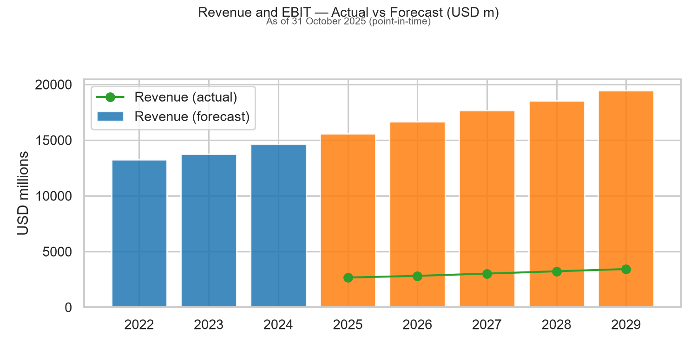
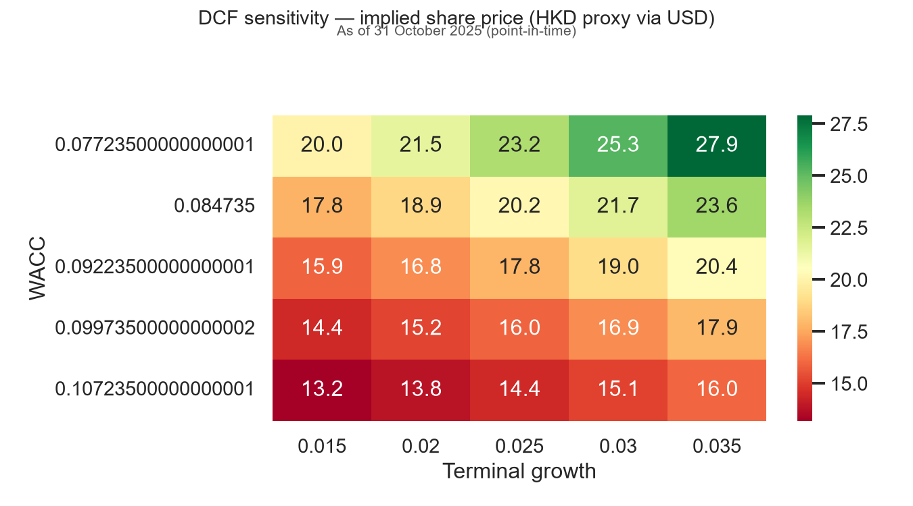
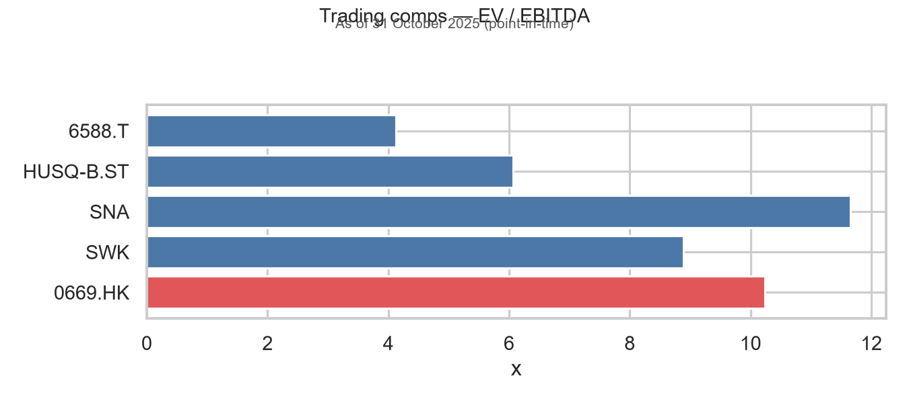
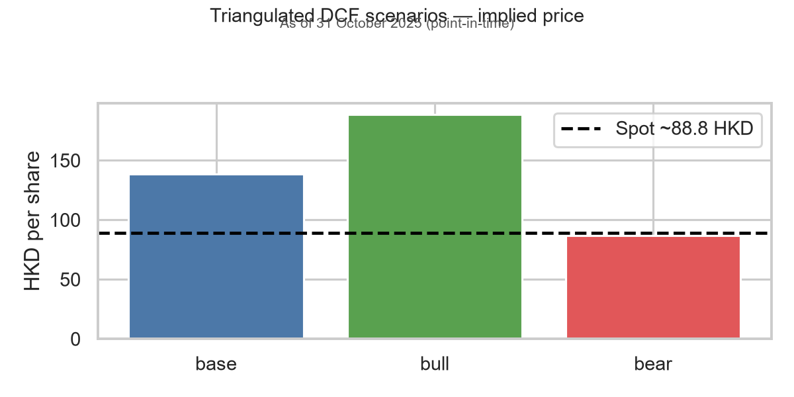

# Investment memo — Techtronic Industries (`0669.HK`)

**Date:** October 2025 (case study)  
**Analyst:** Independent research template  
**Recommendation:** **Buy** (12-month view; base-case DCF and comps support moderate upside)  
**Listing:** Hong Kong Stock Exchange | **Reporting:** USD | **Sector:** Industrials / power tools & outdoor equipment  
**Analysis date:** October 2025  
**Knowledge cutoff:** 31 October 2025 — only information an analyst could have used by that date: last filed **annual** accounts (**FY2024**, year-end December 2024), peer statements on the same basis, and **HKEX close on or before 31 Oct 2025**. No FY2025 full-year results, no 2026 prices, no later filings.

<!-- AUTO:pit_snapshot -->

> **Disclaimer:** Educational case study using public data replayed to a stated cutoff. Not investment advice. Verify against HKEX filings and company announcements.

---

## 1. Executive summary

Techtronic Industries (TTI) is a Hong Kong–headquartered global leader in cordless power tools (Milwaukee, AEG) and outdoor products (Ryobi), with the majority of revenue tied to North American professional and DIY end-markets. The stock offers a **quality-growth industrial** profile: above-peer growth historically, premium Milwaukee positioning, and structural cordless share gains.

**Base-case view (2025–2026):** Revenue growth re-accelerates modestly as U.S. housing activity stabilizes and inventory channels normalize after destocking. Margin recovery is gradual—promotional pressure in outdoor partially offsets Milwaukee mix and cost programs.

| Metric | View |
|--------|------|
| Base-case rating | **Buy** |
| Valuation approach | DCF (5-yr explicit) + trading comps + transaction precedents |
| Key debate | Depth/duration of U.S. housing & R&R vs Milwaukee innovation cycle |
| Primary risk | Consumer/pro weakness, tariff/input cost shocks, China supply chain |

Valuation exhibits (charts and tables in this document) are generated from the same **Oct 2025 point-in-time** model: **FY2025–FY2029** forecast from an **FY2024** base, with spot and comps as of **31 Oct 2025**.

---

## 2. Business overview & competitive positioning

**What they do:** Design, manufacture, and distribute power tools, outdoor power equipment, floorcare, and related accessories. Milwaukee is the growth engine in **professional** channels (construction, MRO); Ryobi skews **DIY/outdoor**; OEM brands add private-label scale.

**Competitive strengths**

- **Brand & channel:** Milwaukee’s dealer/ecosystem loyalty and battery platform (M18/FUEL) create switching costs.  
- **Innovation cadence:** Faster product cycles vs legacy corded portfolios at peers.  
- **Geographic scale:** Sourcing and distribution footprint across Asia and Americas.  

**Relative weaknesses**

- **Outdoor/DIY exposure:** More cyclical and promotion-sensitive than pure-play pro tools.  
- **Customer concentration:** Big-box and major distributors remain important in North America.  
- **FX & tariffs:** USD reporting but global cost base—policy shifts flow through margins with a lag.  

**Peers (trading):** Stanley Black & Decker (`SWK`), Snap-on (`SNA`), Husqvarna (`HUSQ-B.ST`), Makita (`6588.T`), plus TTI as HK-listed anchor (`0669.HK`).

---

## 3. Sector drivers (2025–2026)

| Driver | Implication for TTI |
|--------|---------------------|
| U.S. residential renovation & pro activity | Core demand for Milwaukee; lagged recovery if rates stay higher for longer |
| Cordless penetration / lithium substitution | Structural share gain vs corded; supports ASP and attachment sales |
| Housing starts & existing home turnover | Correlates with DIY/outdoor (Ryobi) more than pro backlog |
| Retail inventory normalization | Easier YoY comparisons after 2023–24 channel reset |
| Input costs (steel, batteries, electronics) | Margin swing factor; hedging and pricing actions matter |
| Tariffs / trade policy (US–China) | Supply chain flexibility partially mitigates; margin risk in bear case |

**Earnings catalysts (next 12–18 months)**

1. **FY2025 results / guidance** — margin bridge vs raw material and promo headwinds.  
2. **Milwaukee new category launches** (e.g., expansion in storage, safety, outdoor pro) — mix uplift.  
3. **North America POS data** through home-center partners — early read on outdoor recovery.  
4. **Capital allocation** — dividend growth continuity and any buyback signals.  
5. **China macro** — smaller revenue share but sentiment driver for HK-listed names.  

---

## 4. Financial forecast (summary)

**Historical base:** FY2024 actual (latest annual report available at the cutoff). **Forecast:** FY2025–FY2029.

**Base-case operating assumptions (FY2025–FY2029)**

- Revenue CAGR ~5.8% (professional mix + cordless, partially offset by outdoor cyclicality).  
- Gross margin drifting **~40%** on mix and cost savings.  
- SG&A leverage modest as growth re-accelerates.  
- Capex ~2.8% of sales; NWC ~18% of sales (stable).  
- Tax ~17.5% (simplified blended).  

FY2025 growth and margins are **forward estimates** from the FY2024 base (not FY2025 reported actuals, which were not available at the cutoff).

---

## 5. Valuation

### 5.1 DCF (unlevered)

- **WACC:** ~8.5–9.5% (Rf 4.2%, β≈1.05, ERP 5.5%, small debt weight).  
- **Terminal growth:** 2.5% base (developed-market nominal GDP + share gain).  
- **Explicit period:** 5 years unlevered FCF from forecast model.  

**Sensitivities:** WACC versus terminal growth (implied share price); gross-margin shifts ±100–200 bps on the forecast.

### 5.2 Trading comps

Peer median **EV/EBITDA**, **EV/Revenue**, and **P/E** applied to TTI LTM metrics (peer median excludes subject).

<!-- AUTO:comps_implied -->

### 5.3 Transaction comps (illustrative)

Precedent industrial/tool deals (multiples ~11–13× EV/EBITDA) support **mid-cycle** valuation anchors—not point estimates.

<!-- AUTO:txn_comps -->

### 5.4 Triangulation

| Method | Role in thesis |
|--------|----------------|
| DCF | Primary — captures growth, margin, and reinvestment |
| Trading comps | Cross-check — market pricing of peer set |
| Transactions | Floor/ceiling for strategic control premium context |

---

## 6. Bull / base / bear scenarios

| | **Bull** | **Base** | **Bear** |
|---|----------|----------|----------|
| Revenue | +2pp vs base growth | Config vector | −3pp vs base |
| Gross margin | +150 bps vs base | ~40% trajectory | −200 bps (promo/tariffs) |
| Terminal growth | 3.0% | 2.5% | 1.5% |
| WACC | −50 bps (risk-on) | Mid estimate | +100 bps |
| Narrative | Strong U.S. R&R, Milwaukee share gains, outdoor rebound | Normalization | Prolonged housing weakness, price wars in outdoor |
| Implied outcome | Meaningful upside to spot | **Buy** — modest upside / fair risk-reward | Downside to DCF; **Hold/Reduce** |

<!-- AUTO:scenario_prices -->

---

## 7. Risks

- **Cyclical demand:** Delayed recovery in housing-linked categories.  
- **Competitive pricing:** SWK and private label in DIY/outdoor.  
- **Operational:** Product liability, battery technology shifts, recall risk.  
- **Geopolitical:** Tariffs affecting China-sourced components.  
- **Model / data:** Yahoo-derived financials may not match HKEX filings; simplified balance sheet in forecast.  

---

## 8. Conclusion & rating

On **base-case** assumptions, TTI’s combination of Milwaukee-led growth, cordless structural tailwinds, and HK-listed access to a global industrial compounder justifies a **Buy** rating relative to a peer set trading at mixed multiples. The **bear** case is clearly defined around U.S. consumer/pro cyclicality and margin compression; the **bull** case requires sustained mix shift and outdoor recovery.

**Action:** Re-run valuation monthly; downgrade to **Hold** if spot exceeds bull-case implied value or if two consecutive guidance cuts materialize.

---

## Appendix — Model reproduction (source code)

This case study is reproduced with Python (`yfinance` data). Source repository includes `config/case_study.yaml`, modules under `src/`, and `docs/MODEL_DOCUMENTATION.md` for assumption logic. Charts in this memo are generated from the same pipeline used for the valuation summary slide.
